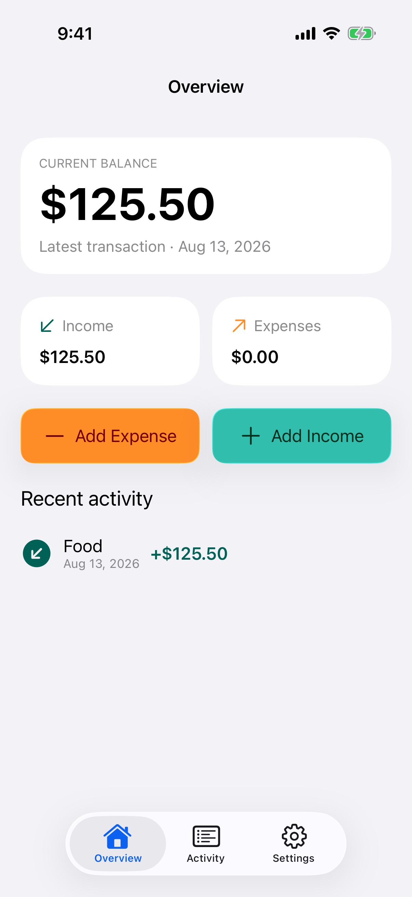
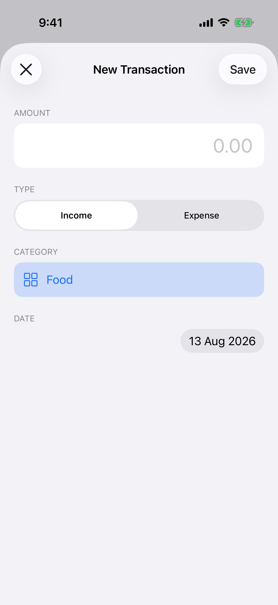
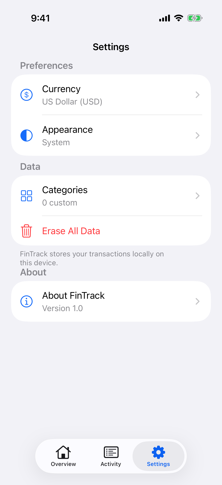
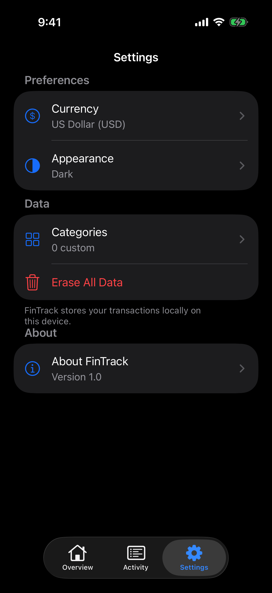

# FinTrack

[](https://github.com/ihormelashchenko/FinTrack/actions/workflows/ci.yml)

FinTrack is a focused UIKit app for recording everyday income and expenses. It
provides a clear running balance, a persistent transaction history, flexible
categories, and a native iOS 26 interface.

## What it does

- Records income and expense transactions with an amount, category, and date
- Persists transaction history and custom categories between launches
- Shows the current balance, income, expenses, and recent activity at a glance
- Supports editing, swipe-to-delete, and confirmed bulk deletion
- Includes built-in categories and user-created categories
- Formats values in US dollars or euros
- Follows the system appearance by default, with optional Light and Dark modes
- Keeps all finance data locally on the device

## iOS 26 design

FinTrack uses standard UIKit navigation, tab bars, menus, sheets, alerts, SF
Symbols, semantic colours, and Dynamic Type. Liquid Glass is reserved for the
primary transaction actions and system navigation layer so the content stays
clear and familiar.

The new Rising Track identity is supplied as an adaptive icon family:

<p>
  
  
  
</p>

- **Default/light:** translucent blue and teal glass on a luminous background
- **Dark:** a higher-luminance mark on deep midnight navy
- **Tinted:** a monochrome version for iOS tinted icon appearances

See [Design and accessibility](docs/design-and-accessibility.md) for the design
decisions and Human Interface Guidelines checklist.

## Screenshots

<p>
  
  
  
  
</p>

## Requirements

- macOS with Xcode 26 or later
- iOS 26 or later

## Run locally

1. Clone the repository:

   ```sh
   git clone https://github.com/ihormelashchenko/FinTrack.git
   cd FinTrack
   ```

2. Open `FinTrack/FinTrack.xcodeproj` in Xcode.
3. Select the `FinTrack` scheme and an iPhone simulator or connected device.
4. Build and run the app.

The project has no third-party dependencies or account setup.

## Verify the project

Build for the simulator:

```sh
xcodebuild \
  -project FinTrack/FinTrack.xcodeproj \
  -scheme FinTrack \
  -configuration Debug \
  -destination 'generic/platform=iOS Simulator' \
  CODE_SIGNING_ALLOWED=NO \
  build
```

Run the unit and interface tests with an installed iOS 26 simulator:

```sh
xcodebuild \
  -project FinTrack/FinTrack.xcodeproj \
  -scheme FinTrack \
  -destination 'platform=iOS Simulator,name=iPhone 17 Pro' \
  CODE_SIGNING_ALLOWED=NO \
  test
```

The shared scheme runs four finance-store tests and two end-to-end interface
tests. GitHub Actions also builds the app for pushes to `main` and pull
requests.

## Project structure

```text
FinTrack/
├── branding/                         # Source logo appearances
├── docs/
│   ├── design-and-accessibility.md
│   └── screenshots/
└── FinTrack/
    ├── FinTrack.xcodeproj/
    ├── FinTrack/                     # UIKit app and adaptive assets
    ├── FinTrackTests/                # Finance model and persistence tests
    └── FinTrackUITests/              # Core user-flow tests
```

## Author

Created by [Ihor Melashchenko](https://ihormelashchenko.com).
